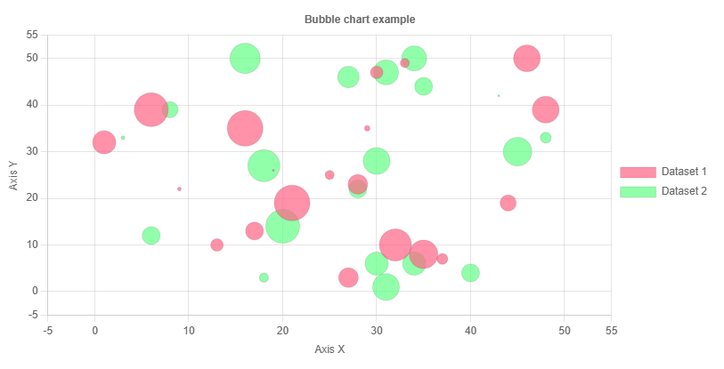
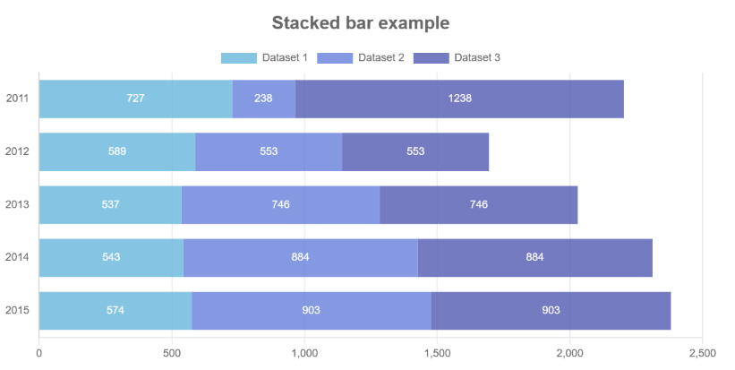

# Chart JS basics
```
cd Bubble
npm install chart.js
npm run dev
```

```
cd Stacked
npm install chart.js
npm run dev
```


- Bubble chart example
<p align="center">

</p>


- Stacked chart example
<p align="center">

</p>